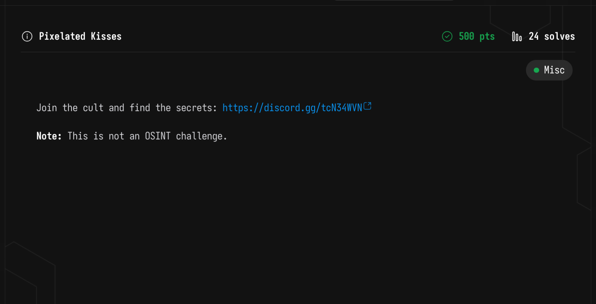
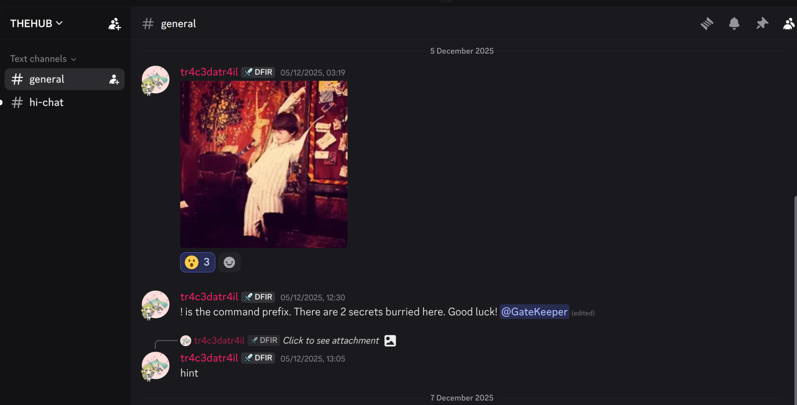
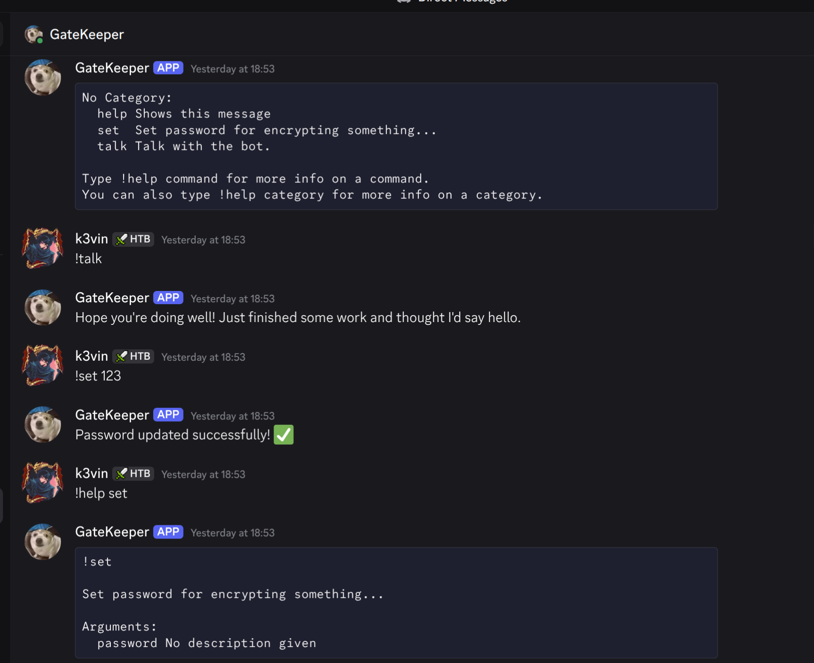
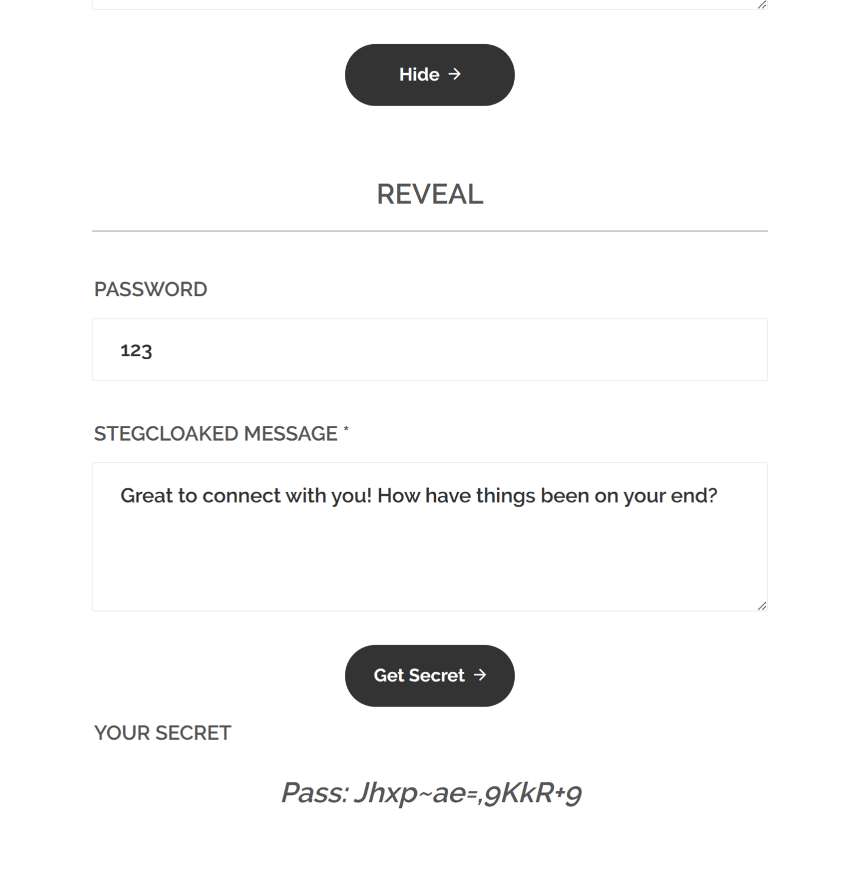
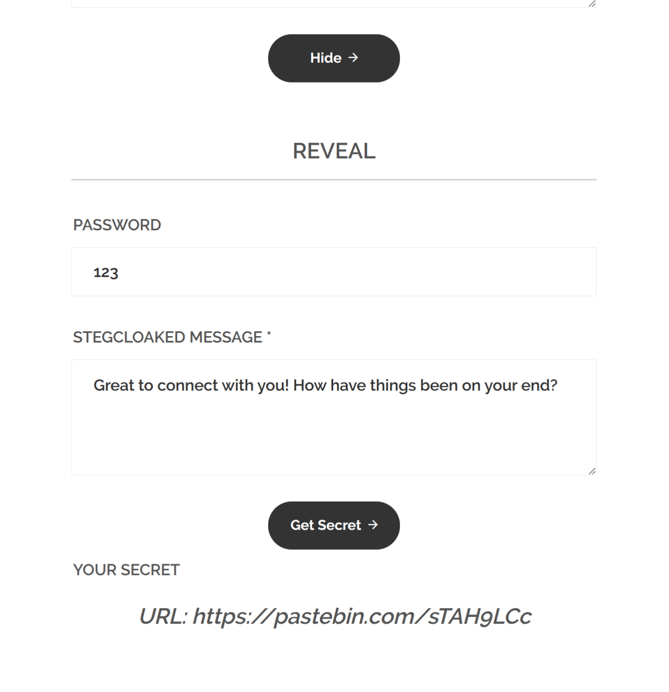
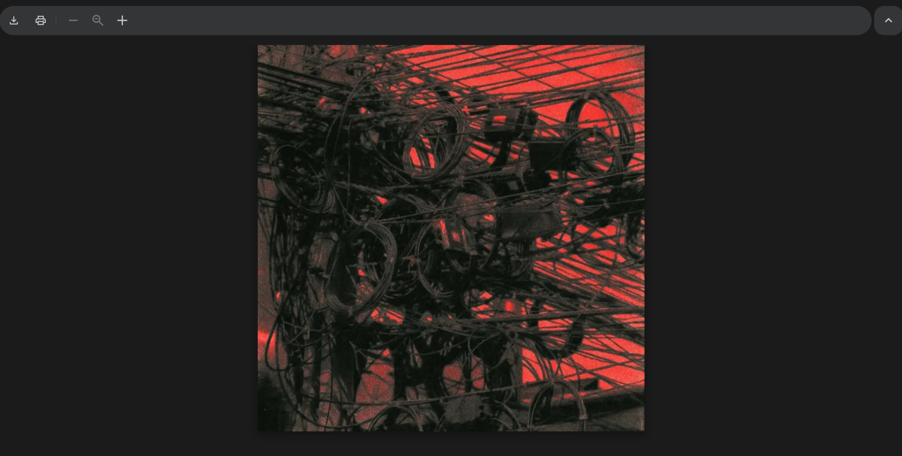
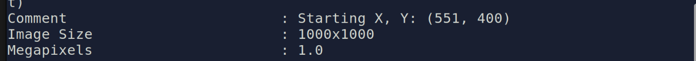

Some CTF challenges that I solved during and after the competition.


# Miscellaneous

## Pixelated Kisses



This challenge was pretty tough but also really interesting for me to do. I finally got it after the comp ended.

First, I joined the server to figure out what was happening in there.


There is a Discord bot called `GateKeeper` in the server. The author gave a hint about some kind of `invisible-cloak`, which I’ll mention later. You can interact with `GateKeeper` using Discord commands with the prefix `!`. 

I tried messing around with it in the server for a while, but nothing really happened. Then I started doing private chat with the bot, and that's when things started to get strange. There are some commands available here, the most important commands are `!set` and `!talk`. At first, the `!talk` command triggers the bot to start yapping a lot with meaningless sentences, `!set` sets some password for the encryption of something.




I was stuck on those commands for a few hours, clueless about what to do and trying to figure out what the bot was trying to convey. I tried to find the connection between those commands, I tested a few different passwords for the `!set` before running `!talk`, but nothing special actually happened, the bot kept yapping as usual. 


Back to the hint, I figured it had something to do with *invisibility* — probably some kind of text steganography. After a bit of Googling, I realized it was StegCloak, which also ties perfectly with the Harry Potter GIF hint about the invisible cloak. StegCloak hides data inside some invisible unicode characters, making the message completely invisible in plain text. Once I knew that, everything started to make sense, and I could finally extract the hidden text inside the bot’s responses. 

First, I `!set` the password for the bot, then `!talk` with it. 


Copy full response of the `GateKeeper` and see the invis characters in the content.


Now we use the password that we `!set` before to decode the hidden content in the bot's response.

| | |
|:--:|:--:|
|  |  |


Leading us to the Pastebin file, accessing it with the password provided, we got the first part of the flag:


Part 2 is about image stegnography using Linked List Pixels technique(hint), something like this: 




After a quick Googling on this stego method, I found that the idea is to hide data by linking specific pixels together instead of storing everything sequentially. Each "linked" pixel points to the next one using its color values or coordinates, and by following that chain, you can recover the hidden message. And the key to this technique is to identify the start coordinates before recovery. Checking the metadata of this image, I found this:



With this information, I can quickly extract the hidden message within this picture by using this [tool:](https://github.com/FlorianPicca/Linked-Pixel-Steganography)


```bash showLineNumbers=false
python3 unhide.py -f part2_hidden.png -o decode.txt -x 551 -y 400
```


Now we know that, the original picture contains some more secret inside those chunk bytes of it, let `zsteg` it with all modes:

```bash showLineNumbers=false
zsteg -a part2_hidden.png
```

Spotting the `imagedata` field in the Base64 format.


We all know that RC4 only works with binary data. We will decode that data field into binary using this command:

```bash showLineNumbers=false
echo -n 'QWFQFwXExM1G15jYRXZVk5gFPsXa7OPeaNlu0e6HWHotgzfC9+UH0Gogd69A' | base64 -d > cipher.bin
```

Now write a small python script to decrypt that binary data using the RC4 key provided:

```python
from Crypto.Cipher import ARC4

key = b"p2wQmmvng82ksBHXyVcABWzkpkfv40xN"
with open("cipher.bin", "rb") as f:
    data = f.read()

cipher = ARC4.new(key)
plain = cipher.decrypt(data)

print(plain)
```

That's all, the second part of the flag finally showed up:


*`W1{https://youtu.be/acA8Rr3gEco_I-L0\\/3_JoJ!_d0_yOu-l()v33_H|m_tOoOo0oOO????}`*


This is my first time writing a blog, so feel free to DM me if you have any questions, feedback, or just need a guy to chat.

Thank you for reading, and see you in the next writeup!

Peace <3